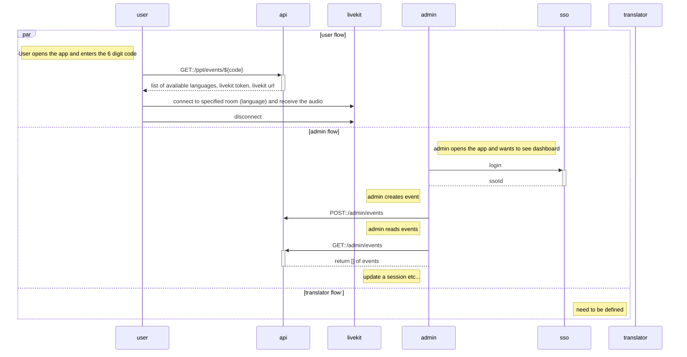

# Translation App API Routes



## User Endpoints

### GET::/user/events/${code}

Get the session details based on a code. We should ensure that this route has some rate limiting on a user basis / ip basis to avoid that
someone can just try all 6 digit codes to get access to a session.

```typescript
type UserEvent = {
    language: string;
    livekitToken: string;
    livekitUrl: string;
};

//returns
UserEvent[]
```

## Admin Endpoints

### Admin Login

we will be using SSO for this. We have to setup some callback route for
this. We can look at this later.

### POST::/admin/events

Create a new empty event. - Need to give the name of the event - event timings

```typescript
type Event = {
    startTime: Date;
    pptCount: number; //expected number of participants
    name: string; // the name of the event
    code: string; //auto generated code on the backend to access a session
    languages: string[]; //array of all the languages supported
};
```

### POST::/admin/events/{eventId}/languages

Add a new language to an existing event. The 6 digit code for the
language will be created automatically in the backend to create a
certain randomness so thats more difficult to just get access to a
session. - Languages should come from an enum so we can on give valid languages.

### PATCH::/admin/events/{eventId}

Update the session detail. - session name - event timings

### DELETE::/admin/events/{eventId}/languages/{language}

delete a language

### DELETE::/admin/events/{eventId}

delete the event

---

-   **POST /login**

    -   Authenticate users with a 6-digit code.
        [TK]: no login is needed as such they are entering the code. If they enter a valid code we return the languages. Could be replaced GET::user/events/${code}

-   **GET /languages**

    -   Retrieve a list of available languages for the event.
        [TK]: I think not needed we can call user/events which will return a list of all languages available

-   **POST /stream/start**

    -   Start streaming audio in the selected language.
        [TK]: This is not about streaming audio but we can use this to start the session (servers)

-   **POST /stream/stop**

    -   Stop the current audio stream.
        [TK] We can use this to stop the servers once the session is over

-   **GET /stream/status**
    -   Check the status of the audio stream.
        [TK]: No need for this route I feel

## Admin Endpoints

-   **POST /admin/login**

    -   For admin login to the dashboard.
        [TK]: we will later use sso for this. We can ignore this in the first version

-   **POST /admin/events**

    -   Create a new event/session.

-   **GET /admin/events**

    -   List all events/sessions.

-   **PATCH /admin/events/{eventId}**

    -   Update an existing event/session.

-   **DELETE /admin/events/{eventId}**

    -   Delete an event/session.

-   **POST /admin/events/{eventId}/languages**

    -   Configure languages for an event/session.

-   **POST /admin/events/{eventId}/codes**
    -   Set or change the access code for an event/session.

## Translator Endpoints

-   **POST /translator/login**

    -   For translator login.
        [TK]: same as for user

-   **GET /translator/sessions**

    -   List sessions available for translation.
        [TK]: same as for user

-   **POST /translator/stream/start**

    -   Start a translation stream.

-   **POST /translator/stream/stop**

    -   Stop a translation stream.

-   **GET /translator/stream/status**
    -   Check the status of the translation stream.

## Common Endpoints

-   **GET /health**
    -   Check the system's health.
        [TK]: this we can add later once we have the rest in place
